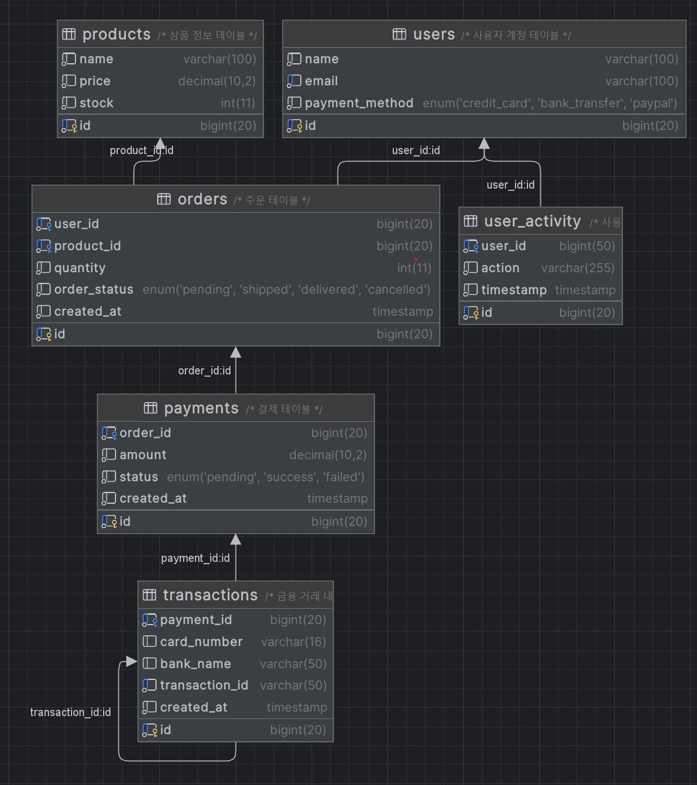

# 결제 시스템 및 사용자 로그 처리 프로젝트

이 프로젝트는 **Kafka 및 RabbitMQ**를 활용하여 대규모 트래픽을 처리할 수 있는 **결제 시스템 및 사용자 로그 적재 시스템**입니다.  
주요 목표는 **확장성**, **신뢰성**, **실시간 알림**, **효율적인 로그 관리**를 제공하는 것입니다.

---

## 🛠️ 기술 스택

- **Backend:** Java 17, Spring Boot 3.x
- **Messaging:** Apache Kafka, RabbitMQ
- **Database:** MariaDB (JPA, Hibernate)
- **ORM Framework:** Spring Data JPA
- **Build Tool:** Maven

---

## 📁 프로젝트 구조

```
payment-system/
├── src/
│   ├── main/
│   │   ├── java/com/taehui/
│   │   │   ├── config/        # 설정 관련 (Kafka, RabbitMQ, DB 등)
│   │   │   ├── controller/    # REST API 컨트롤러
│   │   │   ├── service/       # 비즈니스 로직
│   │   │   ├── repository/    # JPA Repository
│   │   │   ├── model/         # JPA 엔티티 및 DTO
│   │   │   ├── model/         # 엔티티 및 DTO
│   │   │   ├── consumer/      # Kafka 및 RabbitMQ 소비자 처리
│   │   │   ├── producer/      # Kafka 발행자 처리
│   │   ├── resources/
│   │   │   ├── application.yml  # 환경설정 파일
│   ├── test/
├── README.md
├── pom.xml
└── .gitignore
```

---

## ⚙️ 시스템 아키텍처

```
[사용자 요청]
    ↓
[API Gateway]  -- (속도 제한 및 인증)
    ↓
[Kafka (결제 요청)]
    ├─ [결제 서비스 (승인 후 Kafka 이벤트 발행)]
    │   ├─ [발주 서비스]  
    │   ├─ [정산 서비스]  
    │   └─ [알림 저장 (Kafka)]
    ↓
[RabbitMQ (알림 전송)]
    ├─ [SMS]
    ├─ [푸시 알림]
    ├─ [이메일 발송]
    ↓
[Kafka (로그 수집)]
    ├─ [MariaDB (검색 및 보관)]
```

---
## 📊 ERD 다이어그램
아래는 이 프로젝트의 ERD(Entity Relationship Diagram)입니다.


---
## 🧱 주요 기능

### 1. 결제 시스템 흐름

1. 사용자의 결제 요청 → Kafka 토픽(`payment-request`)으로 발행
2. 결제 서비스가 요청을 구독 후 처리 진행
3. 발주 및 재고 확인 → Kafka를 통해 후속 처리 서비스 연결
4. 최종적으로 RabbitMQ를 통해 사용자 알림 발송

### 2. 사용자 로그 적재

1. 사용자 상품 검색 및 방문 로그 → Kafka 토픽(`user-activity`) 발행
2. Kafka Consumer가 MariaDB에 로그 적재


---

## 📊 모니터링 및 로깅

- Prometheus, Grafana를 활용하여 Kafka 및 RabbitMQ 모니터링 가능.
- Spring Boot Actuator를 활용한 메트릭 제공.
- 로그 관리는 중앙 집중식으로 MariaDB에 저장.

---

## 🤝 기여 방법

1. 이 저장소를 포크합니다.
2. 새로운 브랜치를 만듭니다. (`feature-새로운기능`)
3. 변경 사항을 커밋합니다. (`git commit -m '새로운 기능 추가'`)
4. 브랜치를 푸시합니다. (`git push origin feature-새로운기능`)
5. Pull Request를 생성합니다.

---

## 📜 라이선스

이 프로젝트는 MIT 라이선스를 따릅니다.

